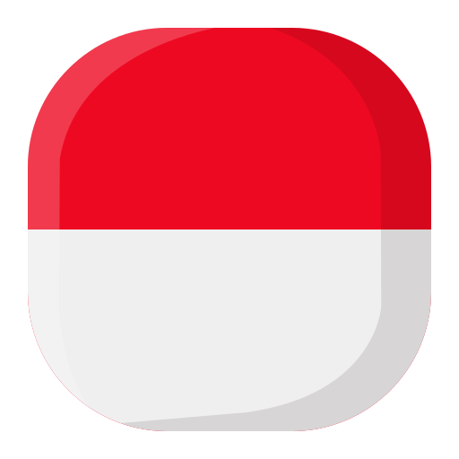

</img>

<table align="right">
 <tr><td><a href="#"> Indonesia</a></td></tr>
 <tr><td><a href="#"> English</a></td></tr>
</table>

### :space_invader: &nbsp;About Me

&nbsp;&nbsp;&nbsp;:technologist: &nbsp;Currently work as Full Stack Developer at [CEXUP](https://cexup.com/) (Jakarta Barat) \
&nbsp;&nbsp;&nbsp;:seedling: &nbsp;Love for science and innovation.\
&nbsp;&nbsp;&nbsp;:heartbeat: &nbsp;Passionate with problem solving and daily routines automation.\
&nbsp;&nbsp;&nbsp;:hammer_and_wrench: &nbsp;Coding since 2018 with 3+ years of experience.\

  &nbsp;&nbsp;&nbsp;&nbsp;
  &nbsp;&nbsp;&nbsp;&nbsp;
  </a>

  
<b>:computer: &nbsp;Main tech knowledge</b>

   

&nbsp;
&nbsp;
&nbsp;
&nbsp;\
&nbsp;
&nbsp;
&nbsp;
&nbsp;

\
&nbsp;

&nbsp;
&nbsp;
&nbsp;
&nbsp;\
&nbsp;
&nbsp;
&nbsp;
&nbsp;

  
<b>:brain: &nbsp;Other knowledge, always learning</b>

   

 &nbsp;
 &nbsp;
 &nbsp;

<!-- 

  
<b>:gear: &nbsp;GitHub Statistics</b>

   
    

        
    

    

         
    

 -->
<!-- 

  -->
<!-- 

 -->